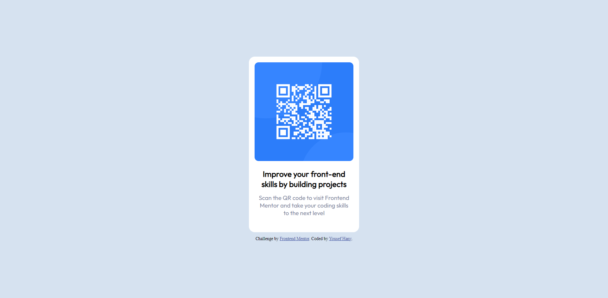

# Frontend Mentor - QR code component solution

This is a solution to the [QR code component challenge on Frontend Mentor](https://www.frontendmentor.io/challenges/qr-code-component-iux_sIO_H). Frontend Mentor challenges help you improve your coding skills by building realistic projects.

## Table of contents

- [Overview](#overview)
  - [Screenshot](#screenshot)
  - [Links](#links)
- [My process](#my-process)
  - [Built with](#built-with)
  - [What I learned](#what-i-learned)
  - [Continued development](#continued-development)
- [Author](#author)

## Overview

### Screenshot

### Links

- Live Site URL: [Add live site URL here](https://yousefhanyy.github.io/QR-code-component/)

## My process

### Built with

- Semantic HTML5 markup
- Flexbox

### What I learned

Better positioning of divs inside each other which was a problem for me.

### Continued development

-Working on better positioning of elements.
-Applying the transform and transition property on more projects.
-Getting used to mroe JavaScript in general.

## Author

- LinkedIn - [Yousef](https://www.linkedin.com/in/yousef-hany-mahmoud/)
- Frontend Mentor - [@yousefHanyy](https://www.frontendmentor.io/profile/yourusername)
